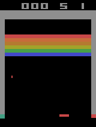
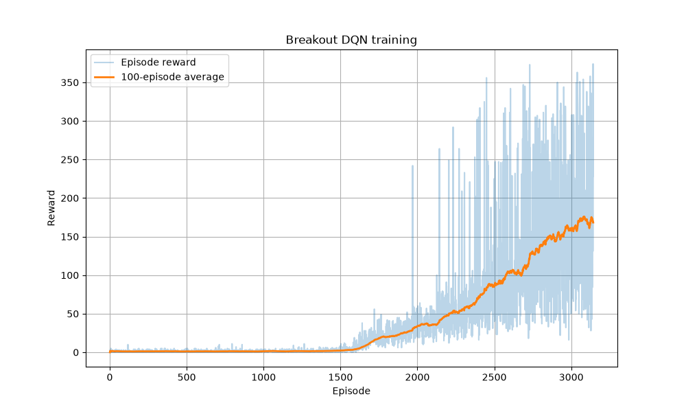

# Deep Reinforcement Learning Agent for Atari Breakout

A Double Deep Q-Network (DQN) that learns to play Atari Breakout directly from screen pixels, built with TensorFlow/Keras and Gymnasium. After 2 million training steps, the agent averages **131.6 points per game**, compared with **1.4** for random play.

| Random agent | Trained agent |
| :---: | :---: |
|  |  |

## Results

| Agent | Average score | Std. dev. | Best game |
| --- | ---: | ---: | ---: |
| Random actions | 1.4 | 1.1 | 4 |
| Trained DQN (2M steps) | **131.6** | 82.7 | **357** |

Both rows are averages over 30 full games (5 lives each). The trained agent was evaluated with a small amount of randomness (5% random actions), which is standard for Atari evaluation. The best 100-episode average during training was 175.9.

### Training progress



The curve shows the typical DQN pattern: a long flat stretch while the network learns basic features like the ball and paddle positions, followed by a sharp rise once exploration decreases and the agent relies on what it has learned.

GIFs recorded automatically during training show how the agent's play develops:

| 250K steps | 1M steps | 2M steps |
| :---: | :---: | :---: |
|  |  |  |

All eight snapshots (every 250K steps) are in [`gifs/progress/`](gifs/progress/).

## How it works

**Input preprocessing.** Each frame is converted to grayscale and downsampled to 84×84. The agent sees the last 4 frames stacked together, which lets it infer the ball's direction and speed from a still image. Each action is repeated for 4 frames.

**Network.** A convolutional neural network following the architecture from DeepMind's 2015 DQN paper: three convolutional layers followed by a 512-unit dense layer, outputting a Q-value (expected future reward) for each of the 4 possible actions.

**Learning.** The agent is trained with the following standard DQN techniques:
- **Experience replay:** past transitions are stored in a buffer and sampled randomly for training, which breaks up correlations between consecutive frames.
- **Target network:** a separate copy of the network, updated every 10,000 steps, provides stable learning targets.
- **Double DQN:** the online network chooses the next action and the target network scores it, which reduces overestimation of Q-values.
- **Epsilon-greedy exploration:** the share of random actions decays linearly from 100% to 5% over the first 250,000 steps.
- **Reward clipping and Huber loss** keep gradient updates stable.
- **Life-loss signals:** losing a life is treated as the end of an episode for learning purposes, so the agent learns that missing the ball is costly.

## Usage

Requires Python 3.11.

```bash
python3.11 -m venv venv
source venv/bin/activate
pip install -r requirements.txt
```

```bash
# Score a random agent (baseline)
python breakout_dqn.py baseline --episodes 30 --gif

# Train the agent (about 2–3 hours on an Apple Silicon Mac)
python breakout_dqn.py train --steps 2000000

# Evaluate a trained model
python breakout_dqn.py eval --model checkpoints/best.keras --episodes 30 --gif
```

Training writes episode rewards to `plots/rewards.csv`, updates `plots/training_rewards.png` every 50,000 steps, and saves a gameplay GIF to `gifs/progress/` every 250,000 steps. Run `python breakout_dqn.py train --help` to see all settings.

## Project structure

```
breakout_dqn.py     Training, evaluation, and baseline code
requirements.txt    Python dependencies
plots/              Training curve and per-episode rewards
gifs/               Gameplay recordings (baseline, evaluation, training progress)
```

## Tech stack

Python, TensorFlow/Keras, Gymnasium, Arcade Learning Environment (ale-py), NumPy, OpenCV, Matplotlib, imageio
